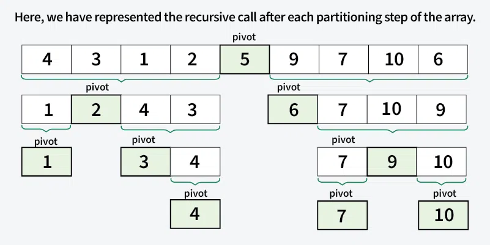
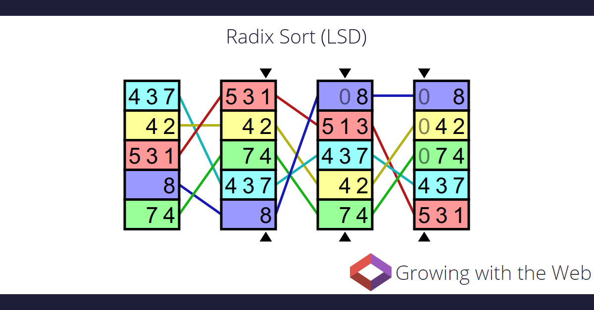

# Poznámky na zkoušku

## Algoritmus

- **Definice**: Obecná pravidla určující transformaci vstupních dat na výstupní.
- **Přesná definice**: „Algoritmus je procedura proveditelná Turingovým strojem."

---

## Program

- Realizace algoritmu.

---

## Základní vlastnosti algoritmu

1. **Hromadnost**  
    Algoritmus řeší obecnou třídu problémů, nikoliv konkrétní problém (např. výpočet součinu dvou celých čísel, ne pouze 2×8).
    
2. **Determinismus**  
    Každý krok je jednoznačně definován – vždy víme, co se má provést.
    
3. **Rezultativnost (konečnost)**  
    Algoritmus vždy skončí a vrátí výsledek (i chybové hlášení).
    
4. **Efektivnost**
    
    - Operace jsou dostatečně jednoduché (lze je provést ručně na papíře).
    - Kritéria:
        - **Časová složitost** – jak rychle algoritmus běží.
        - **Paměťová složitost** – kolik paměti vyžaduje.
        - **Přehlednost** – srozumitelnost implementace.
5. **Správnost**  
    Algoritmus musí pro všechny platné vstupy vrátit správné výsledky.
    
6. **Nezávislost na prostředí**  
    Algoritmus není vázán na konkrétní platformu nebo prostředí.
    

---

## Etapy řešení algoritmické úlohy

1. **Zadání**: Formulace problému a cílů.
2. **Rozbor a analýza**: Volba strategie, specifikace:
    - Vstupy – identifikátory, typy proměnných, podmínky.
    - Výstupy – identifikátory, popisy, typy proměnných.
3. **Návrh algoritmu**:
    - Možné způsoby zápisu:
        - Pseudokód
        - Vývojový diagram
        - Programovací jazyk
        - Strukturovaný přirozený jazyk
4. **Testování**: Ověření správnosti návrhu.
5. **Kódování**: Přepis do programovacího jazyka, ladění, optimalizace.
6. **Dokumentace**: Zpracování doprovodných materiálů.

---

## Klasifikace algoritmu podle složitosti

| **Složitost**  | **Typ**                         |
| -------------- | ------------------------------- |
| **O(1)**       | Konstantní čas                  |
| **O(log n)**   | Logaritmická složitost          |
| **O(n)**       | Lineární složitost              |
| **O(n log n)** | Lineárně logaritmická složitost |
| **O(n²)**      | Kvadratická složitost           |
| **O(n³)**      | Kubická složitost               |
| **O(2ⁿ)**      | Exponenciální složitost         |
| **O(n!)**      | Faktoriální složitost           |


---

## Rekurze

- **Definice**: Podprogram volá sám sebe v průběhu své činnosti.

### Typy rekurze

1. **Přímá rekurze**  
    Podprogram volá sám sebe:

```c
void A(…)
{

  A();

}
```

2. **Nepřímá rekurze**  
	Dva podprogramy se volají vzájemně:

```c
void A(…)
{
  B();
}

void B(…)
{
  A();
}
```

---

## Třídící algoritmy

### Insertion Sort

- **Složitost**: O(n²)
- **Princip**: Algoritmus prochází seznam a vkládá každý prvek na správnou pozici v již seřazené části seznamu.
- **Výhody**:
    - Jednoduchá implementace.
    - Efektivní pro malé a částečně seřazené množiny.
- **Stabilní algoritmus**: Zachovává pořadí prvků se stejnými klíči.
- **Použití**: Třídění malých nebo téměř seřazených datových sad.


---

### Bubble Sort

- **Složitost**: O(n²)
- **Princip**: Opakovaně porovnává sousední prvky a prohodí je, pokud jsou v špatném pořadí.
- **Výhody**:
    - Nejjednodušší na implementaci.
- **Nevýhody**:
    - Nevhodný pro velké datové sady.
- **Použití**: Pedagogické účely nebo pro seznamy, které jsou již částečně seřazené.


---

### Merge Sort

- **Složitost**: O(n log n)
- **Princip**: Rozdělí seznam na menší podseznamy, které jsou seřazeny a následně sloučeny do jednoho seřazeného seznamu.
- **Výhody**:
    - Dobré pro velké datové sady.
- **Nevýhody**:
    - Vyžaduje více paměti.
    - Složitější implementace.
- **Použití**: Třídění velkých datových sad, kde je důležitá stabilita třídění (např. databáze).


---

### Quick Sort

- **Složitost**: O(n log n)
- **Princip**: Vybere pivotní prvek a rozdělí seznam na dvě části – menší než pivot a větší než pivot, které jsou následně tříděny rekurzivně.
- **Výhody**:
    - Rychlý pro běžné datové sady.
- **Použití**: Efektivní třídění velkých datových sad, běžně používané v praxi.


---

### Heap Sort

- **Složitost**: O(n log n)
- **Princip**: Vytvoří binární haldu a opakovaně vybírá maximum (nebo minimum) a umísťuje ho na správné místo v seznamu.
- **Výhody**:
    - Stabilní paměťové nároky.
    - Výkon není ovlivněn vstupním uspořádáním.
- **Nevýhody**:
    - Složitější implementace.
- **Použití**: Algoritmy založené na haldě, jako je výběr k-tého nejmenšího prvku. 


---

### Counting Sort

- **Složitost**: O(n + K) (kde K je rozsah hodnot).
- **Princip**: Počítá frekvenci jednotlivých hodnot a vytváří výstupní seznam podle těchto frekvencí.
- **Výhody**:
    - Stabilní.
- **Nevýhody**:
    - Paměťově náročný pro velká K.
- **Použití**: Třídění čísel v omezeném rozsahu (např. celé čísla mezi 0 a 100). 


---

### Bucket Sort

- **Složitost**: O(n) (při rovnoměrném rozdělení).
- **Princip**: Rozdělí prvky do několika "kbelíků" a každý kbelík se seřadí samostatně.
- **Výhody**:
    - Efektivní pro čísla rovnoměrně rozložená v daném intervalu.
- **Nevýhody**:
    - Neefektivní pro nerovnoměrná data.
- **Použití**: Třídění reálných čísel nebo dat rovnoměrně rozložených v intervalu.


---

### Radix Sort

- **Složitost**: O(n ⋅ d) (kde d je počet číslic největšího čísla).
- **Princip**: Třídí čísla podle jednotlivých číslic, počínaje nejméně významnou.
- **Výhody**:
    - Rychlejší než QuickSort pro specifické vstupy.
- **Nevýhody**:
    - Vysoká paměťová náročnost.
- **Použití**: Třídění celých čísel nebo řetězců s fixní délkou, například ve vědeckých výpočtech.

---

### Selection Sort

- **Složitost**: O(n²)
- **Princip**: Pro každý prvek seznamu najde nejmenší prvek (nebo největší, podle pořadí třídění) a vymění ho s aktuálním prvkem.
- **Výhody**:
    - Velmi jednoduchý algoritmus, snadno pochopitelný.
    - Nevyžaduje žádnou dodatečnou paměť (používá pouze několik proměnných pro uchování indexů).
- **Nevýhody**:
    - Má kvadratickou časovou složitost O(n2)O(n^2)O(n2), což znamená, že je pomalý pro větší množství dat.
    - Méně efektivní než jiné algoritmy jako QuickSort nebo MergeSort pro velké seznamy.
- **Použití**: Vhodný pro malý nebo částečně seřazený seznam, nebo když je potřeba minimalizovat použití paměti.


---

## Stromy

### 1. **Binární vyhledávací stromy (BST)**

- **Definice**: Binární strom, kde každý uzel má hodnotu, která je větší než hodnoty ve všech uzlech v levém podstromu a menší než hodnoty v pravém podstromu.
- **Operace**:
    - Vkládání: O(log N) průměrně, ale v nejhorším případě O(N) (pokud strom degeneruje na seznam).
    - Vyhledávání: O(log N) průměrně, ale O(N) v nejhorším případě.
    - Smazání: O(log N) průměrně, ale O(N) v nejhorším případě.
- **Problémy**: Pokud vkládáme uzly ve vzestupném nebo sestupném pořadí, strom se stává nevyváženým (degeneruje na seznam), což snižuje výkon operací.

### 2. **AVL stromy**

- **Definice**: Vyvážené binární vyhledávací stromy, kde rozdíl mezi výškami levého a pravého podstromu každého uzlu je maximálně 1.
- **Operace**:
    - **Vkládání**: Po každém vložení uzlu se provádí rotace (jednoduché nebo dvojité), aby strom zůstal vyvážený. Složitost: O(log N).
    - **Vyhledávání**: O(log N) - vždy vyvážený strom.
    - **Smazání**: O(log N) - po smazání uzlu je třeba zkontrolovat vyváženost a případně strom upravit.
- **Výhody**:
    - Udržuje strom vyvážený, což zajišťuje optimální výkon.
- **Nevýhody**:
    - Vyvážení může být nákladné, protože může být nutné provést několik rotací.

### 3. **Red-Black stromy**

- **Definice**: Červeno-černé stromy jsou binární vyhledávací stromy, kde uzly mají barvu (červená nebo černá). Existuje několik pravidel pro zachování vyváženosti:
    - Kořen je černý.
    - Děti červeného uzlu jsou černé.
    - Každý list je černý.
    - "Černá" hloubka (počet černých uzlů na cestě k listu) je stejná pro všechny listy.
- **Operace**:
    - **Vkládání**: Nový uzel je vždy červený. Pokud dojde k porušení pravidel, strom je upraven (rotace a přebarvení uzlů). Složitost: O(log N).
    - **Vyhledávání**: O(log N).
    - **Smazání**: O(log N) - po smazání uzlu se provádí korekce, pokud jsou porušena pravidla.
- **Výhody**:
    - Méně přísné než AVL stromy, což znamená méně rotací při vkládání a mazání.
    - Vyváženost není tak striktní, což může vést k rychlejšímu výkonu při vkládání.
- **Nevýhody**:
    - Méně striktní vyvážení znamená, že stromy mohou být o něco "hlubší" než AVL stromy.

### Shrnutí:

- **BST**: Základní strom pro vyhledávání, ale může být neefektivní při špatném vkládání.
- **AVL stromy**: Zajišťují vždy vyvážený strom pro efektivní operace, ale rotace mohou být náročné.
- **Red-Black stromy**: Méně přísné vyvážení než AVL, což zjednodušuje operace, ale může být mírně méně efektivní v extrémních případech.

### 2-3-4 stromy

- **Problémy s vyvažováním:** Časté vyvažování při vytváření stromu.
- **Možnost více dětí:** Uzel může mít až 4 děti a až 3 datové položky.
- **Pravidla:**
    - Uzel s 1 datovou položkou má 2 děti.
    - Uzel s 2 datovými položkami má 3 děti.
    - Uzel s 3 datovými položkami má 4 děti.
    - Duplicitní hodnoty nejsou povoleny.
    - Datové položky v podstromu musí být v mezích svých rodičů.

#### Vyhledávání

- **Postup:** Začíná v kořenu, prohledává uzly, dokud nenajde klíč nebo nenajde list.

#### Vkládání

- **Bez plného uzlu:** Nová položka se přidá do listu bez změny struktury stromu.
- **Plný uzel:** Uzel se rozdělí a vyváží strom. Největší prvek jde do nového uzlu a prostřední prvek do rodičovského uzlu.
- **Plný kořen:** Kořen se rozdělí, hloubka stromu se zvětší o 1.

---

## Hašovací tabulky

Hašovací tabulka je datová struktura pro rychlé vyhledávání, vkládání a odstraňování prvků na základě klíče. Používá hašovací funkci k určení indexu v poli, kde je prvek uložen.

### Hlavní koncepty:

- **Hašovací funkce**: Mění klíč na index v tabulce.
- **Kolize**: Když dva klíče mají stejný index, používá se řetězení (seznam na daném indexu) nebo otevřené adresování (hledání jiného volného místa).

### Operace:

- **Vyhledávání, vkládání, odstraňování**: V průměru O(1) časová složitost. Pokud dojde k mnoha kolizím, složitost roste.

### Výhody:

- Rychlé operace v průměru.
- Flexibilita s typy dat.

### Nevýhody:

- Kolize mohou zpomalit výkon.
- Vyšší paměťová náročnost při zvětšování tabulky.

### Příklad v Pythonu:

```python
hashtable = {}
hashtable["jablko"] = 3
hashtable["banán"] = 2
print(hashtable["jablko"])  # Výstup: 3
del hashtable["banán"]
```

---

## Datové struktury

### **Array (Pole)**

- **Co to je**: Datová struktura, která uchovává **sekvenci** prvků stejného typu v **kontiguu** (spojené v paměti). Všechny prvky jsou přístupné pomocí indexu.
- **Výhody**:
    - Rychlý přístup k prvkům pomocí indexu (konstantní čas O(1)O(1)O(1)).
    - Efektivní uložení dat v paměti.
- **Nevýhody**:
    - Fixní velikost: Po vytvoření není možné měnit velikost pole.
    - Složité vkládání a mazání elementů (pokud není na konci).
- **Použití**: Ideální pro **statická data**, kdy je známý počet položek předem (např. tabulka, matice).

### **Array of Arrays (Pole polí)**

- **Co to je**: Datová struktura, která je **pole polí**, tedy pole, jehož každý prvek je polem. Často se používá pro reprezentaci **mřížek** nebo **vícerozměrných dat**.
- **Výhody**:
    - Vhodné pro uchování **matematických matic** nebo **tabulek**.
    - Může mít různé délky pod-polí (různé velikosti řádků v mřížce).
- **Nevýhody**:
    - Náročnější na paměť, protože se jedná o víceúrovňovou strukturu.
    - Může být složitější na práci s dynamickými daty.
- **Použití**: Například pro **matice** nebo **tabulky**, kde každý řádek má specifickou délku (např. databáze nebo grafy).

### **List (Seznam)**

- **Co to je**: Datová struktura, která uchovává **seznam** prvků v libovolném pořadí. Na rozdíl od pole, seznamy jsou **dynamické** a jejich velikost lze měnit během běhu programu.
- **Typy**:
    - **Jednoduchý seznam**: Každý prvek obsahuje hodnotu a ukazatel na následující prvek.
    - **Dvojitý seznam**: Prvek obsahuje ukazatele jak na předchozí, tak na následující prvek.
- **Výhody**:
    - Flexibilní velikost.
    - Efektivní vkládání a mazání elementů na začátku nebo v průběhu seznamu.
- **Nevýhody**:
    - Pomalý přístup k prvkům (musí se prohledávat celý seznam).
    - Složitější implementace než u polí.
- **Použití**: Vhodné pro **dynamické** datové struktury, kde je potřeba často měnit velikost (např. fronta, zásobník, dynamické seznamy).

### **Tree (Strom)**

- **Co to je**: Strom je hierarchická datová struktura tvořená uzly, kde každý uzel může mít **násobné děti**. Každý uzel obsahuje hodnotu a odkazy na své potomky. Strom je ideální pro reprezentaci hierarchických vztahů, jako je **rodokmen**, **adresářová struktura** apod.
- **Typy**:
    - **Binární strom**: Každý uzel má maximálně dvě děti.
    - **Binární vyhledávací strom (BST)**: Typ binárního stromu, kde jsou hodnoty levých dětí menší než hodnota rodiče a pravých dětí větší.
    - **AVL strom**: Typ binárního vyhledávacího stromu, který je **vyvážený**, aby operace zůstaly efektivní.
    - **B-strom**: Využívá se v databázích pro efektivní vyhledávání a manipulaci s velkými množstvími dat.
- **Výhody**:
    - Rychlé vyhledávání, vkládání a mazání (zejména u vyvážených stromů).
    - Dobré pro reprezentaci **hierarchických dat**.
- **Nevýhody**:
    - Pokud není strom vyvážený, může se chovat jako seznam a mít špatnou výkonnost.
    - Komplexní implementace.
- **Použití**: Používá se v **vyhledávacích algoritmech**, **adresářových strukturách**, **herních stromech rozhodování**, **kódování a kompresi** (Huffmanovy stromy).

---

### **Fronta (Queue)**

- **Co to je**: Datová struktura fungující na principu **FIFO (First In, First Out)** – první vložený prvek bude první odebraný.
- **Operace**:
    - **Enqueue**: Přidání na konec.
    - **Dequeue**: Odebrání z přední části.
- **Použití**: Například při zpracování úloh ve stanoveném pořadí (tisková fronta, správa procesů).

### **Zásobník (Stack)**

- **Co to je**: Datová struktura fungující na principu **LIFO (Last In, First Out)** – poslední vložený prvek bude první odebraný.
- **Operace**:
    - **Push**: Přidání na začátek.
    - **Pop**: Odebrání z začátku.
- **Použití**: Například při sledování historie operací (zpětné navigace, undo).

### Porovnání:

|**Operace**|**Fronta**|**Zásobník**|
|---|---|---|
|**Princip**|FIFO (první dovnitř, první ven)|LIFO (poslední dovnitř, první ven)|
|**Vkládání**|Na konec seznamu|Na začátek seznamu|
|**Odebírání**|Z přední části seznamu|Z přední části seznamu|

### Kdy co použít:

- **Fronta** je vhodná, když je potřeba zpracovávat data v pořadí, v jakém přišla.
- **Zásobník** je užitečný, když potřebujeme pracovat s daty v opačném pořadí, než jak přišla (např. pro historii nebo pro prohledávání).

---

## Vyhledávání řetězců (Pattern Matching)

Vyhledávání řetězců je proces nalezení vzoru (P) v textovém řetězci (T). Tento problém se využívá v textových editorech, webových vyhledávačích nebo analýze obrazů.

#### Základní terminologie

- **Podřetězec**: část řetězce mezi indexy `i` a `j`.
- **Prefix**: podřetězec od začátku až po index `i`.
- **Suffix**: podřetězec od indexu `i` do konce.

### Algoritmus hrubé síly (Brute Force)

Algoritmus prochází všechny pozice v textu a porovnává je s vzorem. Pokud najde shodu, vrátí index počátku vzoru. Pokud ne, posune vzor o jeden znak a pokračuje.

- **Časová složitost**: O(mn), kde `m` je délka vzoru a `n` délka textu.
- **Výhody**: Rychlý pro velké abecedy.
- **Nevýhody**: Pomalý pro malé abecedy (např. binární soubory).

Příklad implementace v Javě ukazuje, jak procházet text a hledat vzor.

### Algoritmus Boyer-Moore

Tento algoritmus využívá zrcadlový přístup, kde hledáme vzor od konce směrem k začátku a přeskočíme části textu, které neodpovídají.

- **Funkce Last()**: Předzpracovává vzor a pro každý znak abecedy uchovává poslední výskyt daného znaku.
- **Časová složitost**: O(nm + A), kde `A` je velikost abecedy.
- **Výhody**: Rychlý pro velké abecedy, pomalejší pro malé.

Příklad ukazuje, jak se vzor posouvá v textu na základě funkce Last().

### Algoritmus Knuth-Morris-Pratt (KMP)

KMP využívá chybovou funkci (failure function), která určuje, jaký je největší možný posun vzoru, aby se vyhnul zbytečným porovnáním po neshodě.

- **Chybová funkce**: Předzpracovává vzor a definuje maximální prefix, který je zároveň suffixem vzoru.
- **Výhody**: Rychlejší než brute force a Boyer-Moore pro specifické případy.
- **Použití**: Vylepšuje brute force algoritmus tím, že po neshodě přeskočí část vzoru.

---

## Prohledávání s návratem (Backtracking)

- **Co to je**: Algoritmus pro systematické procházení všech možností, kde se při uvíznutí vrátí k poslednímu rozhodnutí a zkouší jiný postup.
- **Princip**: Jdi dopředu, dokud to jde, pak se vrať a zkoušej jiné možnosti.
- **Použití**: Permutace, grafy, herní úlohy (šachy, dáma), pokrytí šachovnice.

### Příklad:

- **Pokrytí šachovnice**: Kůň musí pokrýt všechny políčka šachovnice. Používá se DFS a backtracking pro hledání řešení.

### Výhody:

- **Efektivita**: Vylučuje špatná řešení bez jejich vyzkoušení.
- **Paralelizace**: Dobré pro paralelní zpracování, kde se problém rozdělí na podúlohy.

### Aplikace:

1. **Optimalizační problémy**: Plánování, obchodní cesty.
2. **Hry**: Šachy, dáma.
3. **Hádanky**: Sudoku, Rubikova kostka.

### Příklady úloh:

- **Odpory**: Sestavení požadovaného odporu kombinováním rezistorů.
- **Magický zapletenec**: Spojení článků do řetízku s minimem rozpojení.

---

## Heuristika

Heuristika je metoda pro řešení problémů, kdy neznáme přesný algoritmus nebo optimální řešení. Vychází z intuice, zkušeností nebo odhadů. Heuristika nikdy nezaručuje nejlepší výsledek, ale je rychlá, jednoduchá a univerzálně použitelná.

### Základní přístupy:

- **Pokus a omyl**: Použití kdekoli, kde není jasná metoda.
- **Vizualizace problému**: Nakreslit obrázek pro lepší pochopení.
- **Práce odzadu**: Začít od předpokládaného řešení a hledat, jak se k němu dostat.
- **Konkretizace problému**: Řešit konkrétní příklad.
- **Obecnější přístup**: Začít s širšími řešeními a zúžit je.

Heuristika funguje tak, že odhaduje, která pokračování problému mají větší šanci na úspěch. Zvyšuje pravděpodobnost, že najdeme řešení dříve, aniž bychom museli prozkoumávat celý prostor možných řešení.

### Příklady aplikace:

- **Šachovnice s koněm**: Heuristika vybírá nejlepší tahy, které vedou k menší pravděpodobnosti zablokování cesty.
- __A_ algoritmus_*: Pro hledání nejkratší cesty v grafu, používá heuristiku pro odhad vzdálenosti k cíli. Heuristika musí být přípustná (nepřecenit vzdálenost) a monotónní (vzdálenost se nikdy nezvýší).

## Pathfinding

### **Bellman-Ford Algoritmus**

Bellman-Ford algoritmus slouží k nalezení **nejkratší cesty** od jednoho vrcholu ke všem ostatním vrcholům v grafu, který může obsahovat i **záporné váhy hran**. Algoritmus je **vhodný pro grafy s negativními váhami**, ale nedokáže pracovat s **negativními cykly**, protože takové cykly vedou k neomezenému snižování celkové vzdálenosti.

#### Postup:

1. Inicializujeme vzdálenosti všech vrcholů na nekonečno, kromě startovního vrcholu, který nastavíme na 0.
2. Pro každou hranu v grafu provedeme **relaxaci** (aktualizace vzdáleností) pro každý vrchol.
3. Tento proces zopakujeme **V - 1krát**, kde **V** je počet vrcholů v grafu.
4. Po provedení těchto kroků zkontrolujeme, zda je možné dále relaxovat nějaké hrany. Pokud ano, znamená to, že graf obsahuje **negativní cyklus**.

#### Složitost:

- **Časová složitost**: O(V×E)O(V \times E)O(V×E), kde **V** je počet vrcholů a **E** je počet hran.

### **Dijkstra Algoritmus**

Dijkstra algoritmus je známý algoritmus pro nalezení **nejkratší cesty** v grafu, který **neobsahuje záporné váhy**. Dijkstra funguje na principu **greedy přístupu**, kde v každém kroku vybírá vrchol s nejmenší vzdáleností.

#### Postup:

1. Inicializujeme vzdálenosti všech vrcholů na nekonečno, kromě startovního vrcholu, který nastavíme na 0.
2. Používáme **prioritní frontu** (nebo min-heap) k výběru vrcholu s nejmenší vzdáleností, který ještě nebyl zpracován.
3. Pro každého sousedního vrcholu aktuálního vrcholu vypočteme novou vzdálenost. Pokud je nová vzdálenost menší než dosud známá, aktualizujeme ji.
4. Opakujeme tento proces, dokud nezpracujeme všechny vrcholy.

#### Složitost:

- **Časová složitost**:
    - Bez použití prioritní fronty: O(V2)O(V^2)O(V2)
    - S prioritní frontou (min-heap): O((V+E)log⁡V)O((V + E) \log V)O((V+E)logV)

### A* Algoritmus

A* je **optimalizovaný algoritmus pro hledání nejkratší cesty** v grafu, který kombinuje **Dijkstrův algoritmus** a **heuristiku**. A* používá heuristickou funkci k urychlení hledání cesty, což ho činí rychlejším než Dijkstra v mnoha případech. A* je ideální pro úkoly, kde je potřeba najít optimální cestu a zároveň využít informací o cíli.

#### Postup:

1. Používá se **funkce f(x)=g(x)+h(x)f(x) = g(x) + h(x)f(x)=g(x)+h(x)**:
    - **g(x)** je skutečná vzdálenost od startovního vrcholu k vrcholu **x**.
    - **h(x)** je heuristická odhadovaná vzdálenost od vrcholu **x** k cíli.
2. Začneme s startovním vrcholem, kde g(start)=0g(start) = 0g(start)=0 a h(start)h(start)h(start) je odhad.
3. Používáme **prioritní frontu**, kde vrcholy jsou vybírány na základě nejnižší hodnoty f(x)f(x)f(x).
4. Pro každý sousední vrchol aktualizujeme hodnoty ggg a fff. Pokud najdeme lepší cestu (nižší fff), aktualizujeme hodnoty a přidáme vrchol do fronty.
5. Algoritmus pokračuje, dokud nenajde cestu k cíli nebo se nedostane do prázdné fronty.

#### Složitost:

- **Časová složitost**: Závisí na použité implementaci fronty a kvalitě heuristiky. Pokud je heuristika optimální, A* je velmi rychlý.

#### Výhody:

- A* je **optimalizovaný** a velmi efektivní pro hledání nejkratších cest, zejména když máme dobrou heuristiku, která směřuje k cíli.
- Dijkstra je specializovaný na **grafy bez záporných hran**, ale A* je **flexibilní** a používá heuristiku k optimalizaci výkonu.

### Shrnutí:

- **Bellman-Ford**: Vhodný pro grafy s negativními váhami, ale pomalejší.
- **Dijkstra**: Rychlý pro grafy bez negativních vah, používá greedy strategii.
- **A***: Kombinuje Dijkstru s heuristikou pro rychlé vyhledávání cesty, ideální pro problémy s konkrétním cílem.